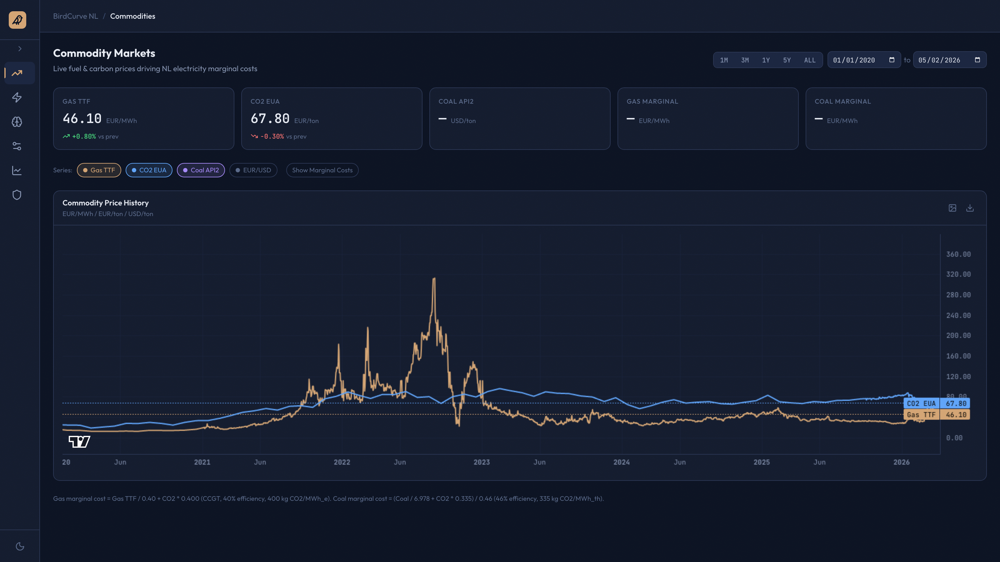
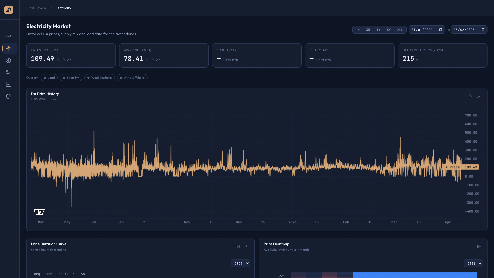
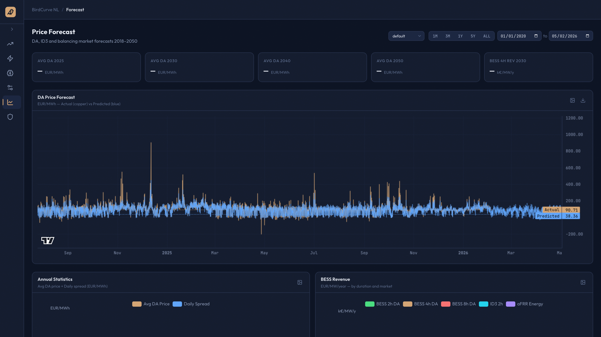
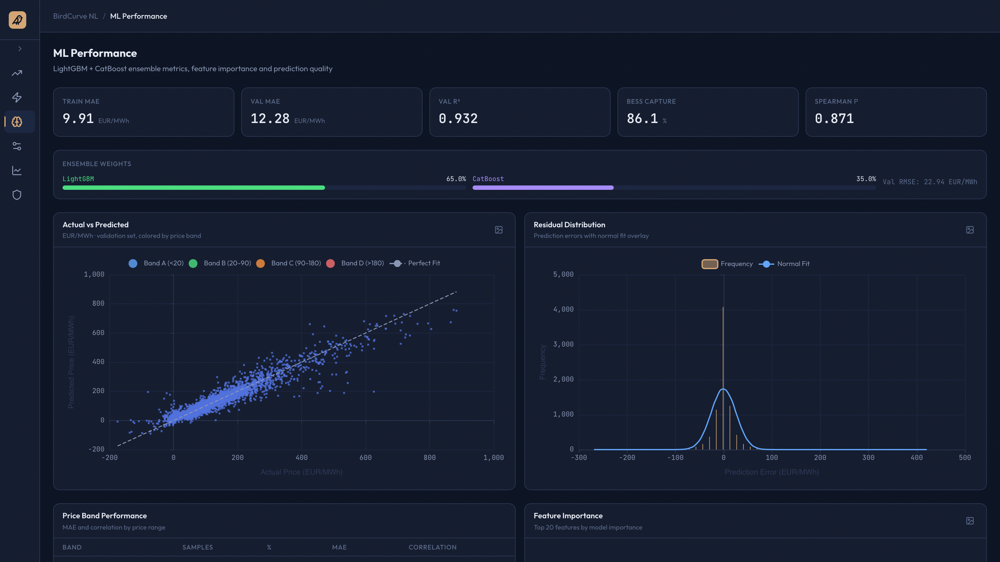
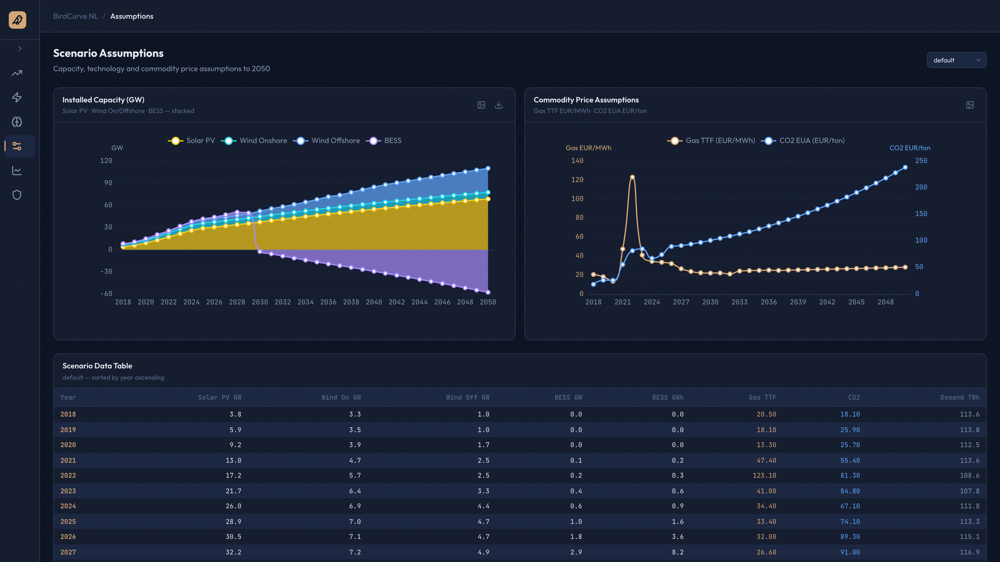

# birdcurve-dashboard

Interactive dashboard for Dutch electricity market data and BirdCurve NL price forecasts.


A six-page web app for exploring the Dutch power market and the [BirdCurve NL](https://github.com/MaykThewessen/BirdCurve_NL) price-forecasting model that drives BESS revenue analysis out to 2050. Inspect commodity prices, the supply/demand stack, day-ahead and intra-day forecasts, ML model diagnostics, ancillary-services capacity, and scenario assumptions — all backed by a single read-only DuckDB file.

> **Why it exists.** Energy analysts need to see the data, the forecast, and the model's behavior in one place — not a Jupyter notebook, not a static PDF. This dashboard is the interactive companion to the BirdCurve NL pipeline: same data, same model, but explorable from any browser.

## Highlights

- **Native DuckDB query engine** — wide-format columnar reads in milliseconds, no ORM, no Python pivot loops
- **Async FastAPI handlers** with threadpool offload for blocking file I/O, and HTTP `Cache-Control` for immutable historical ranges
- **React 19 + TanStack Query + Vite 7** frontend; ECharts for analytics, TradingView lightweight-charts for time series
- **Server-side LTTB downsampling** caps every chart payload to a few thousand points without losing extremes
- **31 integration tests** against a live DuckDB; bring-your-own-data design (no proprietary market data committed)

## Pages

The app is organized into six pages, each backed by its own FastAPI router and React route.

### Commodities — TTF gas & EUA CO₂



Live Gas TTF, CO₂ EUA, Coal API2 and EUR/USD with KPI cards and day-over-day deltas — toggle the **Marginal Costs** overlay to see how fuel + carbon translate into the cost of the next MWh on the grid (CCGT @ 58% LHV efficiency incl. HHV→LHV conversion, coal @ 46%).

### Electricity — supply, demand & cross-border flows



Day-ahead price history with optional load / PV / wind on/offshore overlays, plus a sorted price-duration curve (with negative-hours count) and an hour-×-month heatmap that shows where on the calendar the cashflow actually lives.

### Forecast — day-ahead & intra-day price predictions



BirdCurve NL forecast vs realised DA prices for the selected scenario, with annual avg/spread bars 2018–2050 and BESS revenue per duration class (2h / 4h / 8h DA, ID3 2h, aFRR Energy) in k€/MW/year.

### ML — model diagnostics & feature importance



LightGBM + CatBoost ensemble metrics (MAE / R² / RMSE / Spearman, BESS capture rate), Actual-vs-Predicted scatter coloured by price band, residual histogram with normal-fit overlay, top-20 feature importances, and per-band MAE table — everything you need to audit where the model is sharp and where it drifts.

### Ancillary — FCR / aFRR capacity & regulation states


aFRR Up/Down and FCR capacity-price time-series, an annual revenue stack (aFRR cap + FCR cap + aFRR energy) per scenario year, and a regulation-state donut (Up / Down / No / Mixed) so you can see how the balancing market actually behaves.

### Scenarios — assumptions out to 2050



The assumptions feeding the forecast: stacked installed-capacity area for PV / wind on / wind off / BESS in GW, dual-axis Gas TTF and CO₂ EUA price paths, and a sortable year-by-year data table — exportable to CSV for downstream analysis.

## Architecture

- **Backend** — FastAPI, native DuckDB (read-only), pydantic-settings, async routers with `run_in_threadpool` for blocking I/O, `Cache-Control` and `ETag` response headers.
- **Frontend** — React 19 + Vite + TypeScript, TanStack Query v5, ECharts and TradingView lightweight-charts, Tailwind v4.
- **Data plane** — a single DuckDB file in wide format (`{source}__{column}` columns) plus a directory of `Production_Ensemble_*` and `Forecast_*` model artifacts.

The dashboard does **not** ship with data — you supply your own DuckDB file produced by the upstream [BirdCurve NL pipeline](https://github.com/MaykThewessen/BirdCurve_NL).

## Prerequisites

Toolchains are managed by [pixi](https://pixi.sh) — Python and Node both live in pixi global envs declared in `~/.pixi/manifests/pixi-global.toml`:

- `envs.main` — Python 3.12 plus the backend stack (FastAPI, granian, DuckDB, pydantic, pandas, pyarrow, …)
- `envs.nodejs` — Node + npm + npx

The Makefile invokes `$(HOME)/.pixi/envs/main/bin/python` and `$(HOME)/.pixi/bin/npm` directly, so `~/.pixi/bin` does **not** need to be on your shell PATH. If you don't have pixi installed yet:

```bash
curl -fsSL https://pixi.sh/install.sh | sh
```

## Quickstart

```bash
cd dashboard
make install                      # syncs both pixi envs + npm install

export BIRDCURVE_DUCKDB_PATH=/path/to/your/birdcurve.duckdb
export BIRDCURVE_MODEL_RESULTS_DIR=/path/to/your/model_results

make dev                          # backend on :8000, frontend on :5173
```

Or run the halves separately:

```bash
make backend     # FastAPI on :8000 (separate terminal)
make frontend    # Vite on :5173    (separate terminal)
```

Open <http://localhost:5173>. The frontend talks to the backend at `http://localhost:8000` by default.

## Configuration

All settings are read from environment variables (or a `.env` file in `dashboard/backend/`).

| Var | Default | Purpose |
| --- | --- | --- |
| `BIRDCURVE_DUCKDB_PATH` | `/Users/mayk/birdcurve_nl/data/birdcurve.duckdb` | Path to the read-only DuckDB file. |
| `BIRDCURVE_MODEL_RESULTS_DIR` | `/Users/mayk/birdcurve_nl/model_results` | Directory containing `Production_Ensemble_*` and `Forecast_*` subdirectories. |
| `BIRDCURVE_HISTORICAL_FEATURES_PATH` | `/Users/mayk/birdcurve_nl/Historical_data_features_engineered_*.parquet` | Glob pattern for the parquet feeding the ML correlation matrix endpoint. |
| `BIRDCURVE_EUR_USD_PATH` | `/Users/mayk/birdcurve_nl/Coal/EUR_USD_daily_*.csv` | Optional glob for the EUR/USD daily CSV sidecar; series/KPI degrade to empty when absent. |
| `BIRDCURVE_COAL_API2_PATH` | `/Users/mayk/birdcurve_nl/Coal/commodity_coal_API2_daily_*.csv` | Optional glob for the Coal API2 daily CSV sidecar; same fallback semantics. |
| `BIRDCURVE_CORS_ORIGINS` | `["http://localhost:5173"]` | JSON array of allowed frontend origins. |

## Schema requirement

The backend expects a DuckDB file with **wide-format** time-series tables. One column per source metric, named `{source}__{column}` with a **double underscore** separator. Tables, by sampling resolution:

```text
ts_15min   — 15-minute resolution (load, PV, wind on/off, cross-border, imbalance,
             aFRR/FCR activated energy, regulation state)
             columns include:
               Load_NL__Actual_Load_MW
               NED_PV__PV
               NED_Wind_Onshore__Wind_Onshore
               NED_Wind_Offshore__Wind_Offshore
               CrossBorder_NL__Total_Net
               Imbalance_NL__Price_imb_long
               Imbalance_NL__Price_imb_short
               Imbalance_NL__Price_aFRR_energy_up
               Imbalance_NL__Price_aFRR_energy_down
               Imbalance_NL__reg_state
               aFRR_capacity__Up
               aFRR_capacity__Down
               FCR_activated_energy__FCR_price
               CrossBorder_Belgium__netflow_BE_MW
               CrossBorder_BritNed__BritNed_MW

ts_4hourly — 4-hour resolution (FCR/aFRR capacity prices and volumes)
               aFRR_capacity_price__Up / __Down
               aFRR_capacity_volume__Up / __Down
               FCR_capacity_price / FCR_capacity_volume

ts_hourly  — 1-hour resolution
               DA_price__DA_price
               Temperature_KNMI__T
               Temperature_OpenMeteo__T

ts_daily   — daily resolution
               CO2_EUA__price
               Gas_TTF__price
```

All timestamps are stored in UTC.

## Tests

```bash
cd dashboard/backend
BIRDCURVE_DUCKDB_PATH=/path/to/your/birdcurve.duckdb make test-backend
```

31 backend tests cover the data loader (wide-schema queries), router responses, and configuration. The frontend has no test suite yet — `npm run build` is the contract for type-safety.

## Screenshots

Drop screenshots into [docs/screenshots/](docs/screenshots/) using these filenames so they render automatically:

- `hero-tour.gif` — 5–10 second screencast scrolling across the six pages (recommended: ≤ 1280px wide, 10–15 fps, ≤ 8 MB so it loads inline on GitHub)
- `page-commodities.png`, `page-electricity.png`, `page-forecast.png`, `page-ml.png`, `page-ancillary.png`, `page-scenarios.png` — static PNGs at 1600×900 or wider

### Recording the hero GIF

A reliable pipeline on macOS:

```bash
# 1. record a screen segment to MP4 (Cmd+Shift+5 on macOS, or use any screencast tool)
# 2. convert MP4 → GIF with a shared palette for clean colors and small file size
ffmpeg -i tour.mp4 -vf "fps=12,scale=1280:-1:flags=lanczos,split[a][b];[a]palettegen[p];[b][p]paletteuse" \
  docs/screenshots/hero-tour.gif
```

Aim for under 8 MB; if the GIF is larger, drop fps to 10 or scale to 1024 wide. For a crisper alternative, commit an MP4 instead and reference it with `<video src="docs/screenshots/hero-tour.mp4" controls></video>` — GitHub renders `<video>` tags in README files.

## License

MIT — see [LICENSE](LICENSE).
